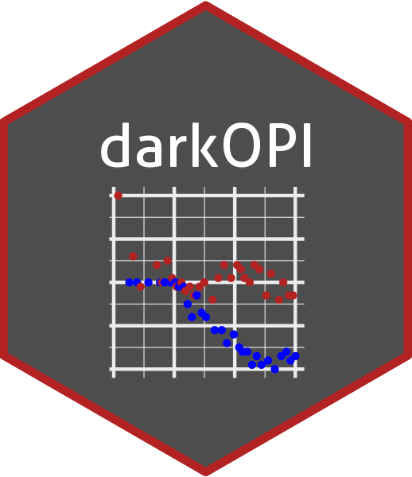
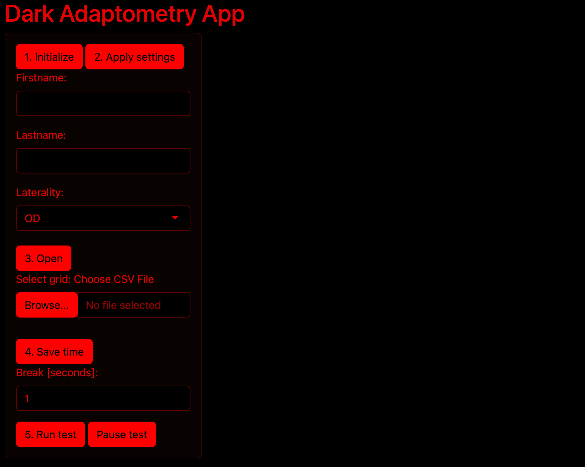

<!-- README.md is generated from README.Rmd. Please edit that file -->

# darkOPI 

<!-- badges: start -->
<!-- badges: end -->

The darkOPI package is built on the Open Perimetry Interface and allows for dark adaptometry testing with the S-MAIA device.

### Contact

Maximilian Pfau, MD: [maximilian.pfau@iob.ch](maximilian.pfau@iob.ch)

### Citation
```
@article {Oertli2023.06.09.23291212,
	author = {Jeannine Oertli and Kristina Pfau and Hendrik P.N. Scholl and Brett G. Jeffrey and Maximilian Pfau},
	title = {Establishing Fully-Automated Fundus-Controlled Dark Adaptometry: A Validation and Retest-Reliability Study},
	elocation-id = {2023.06.09.23291212},
	year = {2023},
	doi = {10.1101/2023.06.09.23291212},
	publisher = {Cold Spring Harbor Laboratory Press},
	URL = {https://www.medrxiv.org/content/early/2023/06/12/2023.06.09.23291212},
	eprint = {https://www.medrxiv.org/content/early/2023/06/12/2023.06.09.23291212.full.pdf},
	journal = {medRxiv}
}
```

```
@article{10.1167/12.11.22,
    author = {Turpin, Andrew and Artes, Paul H. and McKendrick, Allison M.},
    title = "{The Open Perimetry Interface: An enabling tool for clinical visual psychophysics}",
    journal = {Journal of Vision},
    volume = {12},
    number = {11},
    pages = {22-22},
    year = {2012},
    month = {10},
    issn = {1534-7362},
    doi = {10.1167/12.11.22},
    url = {https://doi.org/10.1167/12.11.22},
    eprint = {https://arvojournals.org/arvo/content\_public/journal/jov/933489/i1534-7362-12-11-22.pdf},
}
```

### Manual

To run the up, open the `2023-12-14_Adaptometry-App-V7.R` file.

The IP address of the S-MAIA device must be adjusted in the following line:
```
maia.opiInitialize(ip = "192.168.1.2", port=5555)
```

### Workflow



1. Select the OPI mode as exam mode
2. Click in the app on `1. Intilaize` to initialize the connection
3. Click in the app on `2. Apply Setting`, now the fixation target should show up on the S-MAIA device
4. Enter the name of the participant
5. Proceed in the S-MAIA (i.e., start the exam with alignment, focus, and selection of the optic nerve head), until the S-MAIA states that it is waiting for the OPI-OPEN command
6. Click in the app on `3. Open`; now the IR image with the labeled preferred retinal locus and optic nerve head should be displayed in the app
7. Select the grid with `Browse`
8. Start the test with `5. Run test`
9. To save the fixation data, close the apps (all intermediate results have been saved) and run the code below

```
close_func <- function()
{
  
  writeLines("OPI-CLOSE", .OpiEnv$maia$socket)
  num_bytes <<- readBin(.OpiEnv$maia$socket, "integer", size=4, endian=.OpiEnv$maia$endian)
  print(num_bytes)
  
  fixations <<- matrix(NA, ncol=4, nrow=num_bytes/16)
  
  for (i in 1:num_bytes/16) {
    fixations[i,1] <<- readBin(.OpiEnv$maia$socket, "integer", n=1, size=4, endian=.OpiEnv$maia$endian)
    fixations[i,2:3] <<- readBin(.OpiEnv$maia$socket, "double", n=2, size=4, endian=.OpiEnv$maia$endian)
    fixations[i,4] <<- readBin(.OpiEnv$maia$socket, "integer", n=1, size=4, endian=.OpiEnv$maia$endian)
  }
  
}


try( close_func() )
print("done")

saveRDS(fixations, paste(new_dir, 'fixations.RDS', sep="/") )
```


